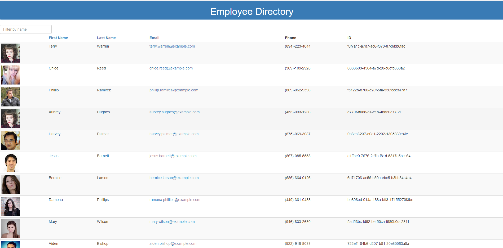

# React Employee Directory

## Table of Contents

- [About](#about)
- [User Story](#user-story) 
- [Technologies](#technologies)
- [Installation](#installation)
- [App](#app)
- [Developer](#developer)
- [Questions](#Questions)

  ## About

  This react app uses randomuser.me API to create a directory of employees. Employee information their photo, first name, last name, email, phone number and employee ID.  

  ## User Story  

  As an employee at a large company, I want to be able to easily find the contact information for my colleagues and co-workers. When I open this app, I can view all the employees at my company. I can view the employees at my company alphabetically by first name, last name or email by clicking on the respective links at the top of the table of employees. I can also easily search for an employee by name using the search bar.  

  ## Technologies

  - Node

  - React

  - Randomuser.me API

  - React UUID

  - Axios

  - HTML, CSS, & Javascript

  ## Installation

  To install necessary dependencies, run the following command in the root folder of this application

  ```
  npm i
  ```

  To run the program, run

  ```
  npm start
  ```  

  ## App  

  ### View [Demo](https://employee-directory-of-wonder.herokuapp.com/)

  


## Developer  

   <div class="CircleBadge CircleBadge--medium bg-gray-dark">
      
   </div>  
   Mackenzie Schutz

## Questions

Please direct all questions the developer  
